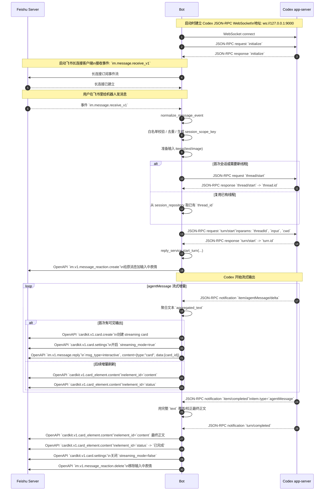

# 主流程时序图

本文只描述主流程，不包含异常处理、重试、审批分支和补充输入分支。

## 时序图

## 关键地址与关键字

- Codex app-server 地址: `ws://127.0.0.1:9000`
- Codex JSON-RPC 主方法: `initialize` / `thread/start` / `thread/resume` / `turn/start`
- Codex 主通知: `item/agentMessage/delta` / `item/completed` / `turn/completed`
- 飞书长连接事件: `im.message.receive_v1`
- 飞书主接口关键字: `im.v1.message.reply` / `cardkit.v1.card.create` / `cardkit.v1.card.settings` / `cardkit.v1.card_element.content`

## 相关代码

- 运行时装配与事件分发: `src/feishu_codex_bot/runtime.py`
- 会话与 turn 派发: `src/feishu_codex_bot/services/conversation_service.py`
- Codex JSON-RPC 客户端: `src/feishu_codex_bot/adapters/codex_client.py`
- 飞书长连接与消息发送: `src/feishu_codex_bot/adapters/feishu_adapter.py`
- 流式回复聚合与卡片更新: `src/feishu_codex_bot/services/reply_service.py`
